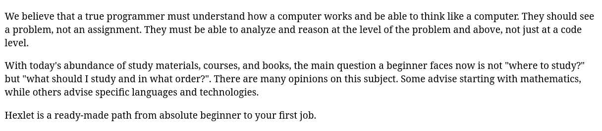

Внутри браузера или другой программы, которая может обрабатывать HTML, текст выводится на основе указанных тегов. Без них браузер не поймёт, как правильно вывести текст.

Посмотрим на пример текста и попробуем вывести его используя разметку тегами и без этого.

Текст:

```html
We believe that a true programmer must understand how a computer works and be able to think like a computer. They should see a problem, not an assignment. They must be able to analyze and reason at the level of the problem and above, not just at a code level.

With today's abundance of study materials, courses, and books, the main question a beginner faces now is not "where to study?" but "what should I study and in what order?". There are many opinions on this subject. Some advise starting with mathematics, while others advise specific languages and technologies.
```

Если вставить текст на страницу без использования тегов, то получим такой результат:

```html
We believe that a true programmer must understand how a computer works and be able to think like a computer. They should see a problem, not an assignment. They must be able to analyze and reason at the level of the problem and above, not just at a code level. With today's abundance of study materials, courses, and books, the main question a beginner faces now is not "where to study?" but "what should I study and in what order?". There are many opinions on this subject. Some advise starting with mathematics, while others advise specific languages and technologies. Hexlet is a ready-made path from absolute beginner to your first job.
```

Это не тот результат, который ожидался — строки слиплись и превратились в одну нечитаемую строку. Для того, чтобы текст выглядел так, как задумано, его необходимо обернуть в теги `<p>`:

```html
<p>We believe that a true programmer must understand how a computer works and be able to think like a computer. They should see a problem, not an assignment. They must be able to analyze and reason at the level of the problem and above, not just at a code level.</p>

<p>With today's abundance of study materials, courses, and books, the main question a beginner faces now is not "where to study?" but "what should I study and in what order?". There are many opinions on this subject. Some advise starting with mathematics, while others advise specific languages and technologies.</p>

<p>Hexlet is a ready-made path from absolute beginner to your first job.</p>
```



Пример иллюстрирует, что оформленный текст в офисном редакторе при открытии в браузере станет одной сплошной строкой, поэтому информация размечается специальными тегами. В процессе прохождения курса рассмотрим теги для создания таблиц, списков, ссылок и логических секций страницы. В этом же уроке мы подробнее рассмотрели параграфы и важность разметки для правильного вывода информации на странице
