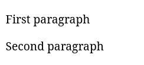

Параграфы – основной способ разделять большой текст на небольшие логические блоки. Эти блоки автоматически «отбиваются» друг от друга отступами. Такой текст намного проще читается и не пугает пользователей.

Параграфы, в основном, встречаются внутри большого текста. Например, любой урок на Хекслете или Code Basics разбит на параграфы для удобства чтения, прямо как в этом уроке.

Разбитие идёт по небольшим смысловым блокам. Так не только комфортнее читать, но и можно быстрее найти нужную информацию в большом тексте.

Параграфы создаются с помощью парного тега `<p>`, в тело которого помещается небольшая часть текста. Например:

```html
<p>First paragraph</p>
<p>Second paragraph</p>
```

Вот как они выглядят в браузере:


