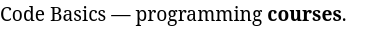
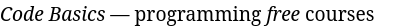

Cualquier texto contiene partes clave que deseamos transmitir al lector. Estas pueden ser definiciones, sugerencias o ideas clave. Si el texto es muy extenso, estas partes pueden perderse o incluso no ser detectadas. ¿Cómo podemos ayudar al navegador y al usuario a encontrar rápidamente estas partes en la página? En la marcación HTML, se pueden usar _negritas_ y _cursivas_ con fines de resaltado.

## Resaltado en Negritas

Para resaltar el texto en negritas, se utiliza uno de los dos pares de etiquetas: `<b>` o `<strong>`:

```html
<p>Code Basics — programming <b>courses</b>.</p>
```



```html
<p>HTML — <strong>Hypertext Markup Language</strong></p>
```


Ambos ejemplos ilustran cómo agregar formato en negritas a un fragmento de texto. Pero, ¿por qué se utilizaron dos etiquetas diferentes para lograr resultados visualmente iguales? Esto se debe a la _semántica_, es decir, el significado. En este caso, el significado de la etiqueta es:

* `<b>` — resaltar simplemente el texto. Puede usarse en cualquier lugar para resaltar visualmente el texto. Esta etiqueta no lleva consigo ningún significado semántico
* `<strong>` — resaltar lógicamente una parte importante del texto. Esta etiqueta tiene un significado semántico y resalta una parte importante. No debe aplicarse en todos los segmentos de manera consecutiva

En el pasado, los desarrolladores querían que estas etiquetas tuvieran una apariencia diferente y se comportaran de manera diferente en el navegador, pero la historia tomó un rumbo diferente. Actualmente, se considera excesivo el uso de `<b>` para el resaltado visual y se debe utilizar CSS para eso, mientras que `<strong>` se usa para resaltar partes importantes.

## Resaltado en Cursiva

En su significado, el resaltado en cursiva es muy similar al resaltado en negritas, pero en lugar de enfatizar partes clave, se pone énfasis. Por ejemplo:

```html
<p><i>Code Basics</i> — programming <em>free</em> courses</p>
```



En este ejemplo, se marcaron dos partes del texto:

* Se utilizó la etiqueta `<i>` para marcar el nombre del portal "Code Basics". Esta etiqueta se usa para resaltar visualmente el texto en cursiva y no lleva consigo ningún significado semántico
* Se utilizó la etiqueta `<em>` para resaltar la frase "cursos gratuitos". Este énfasis lógico está en la gratuidad de los cursos, que se destaca en la oración. Hay muchos cursos, pero no todos son gratuitos, por lo que se enfatiza esta parte de la oración
