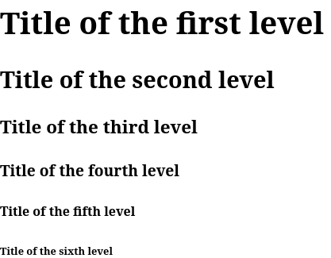

The larger the text, the more often it is divided into logical sections. For example, the basic markup of a report, diploma or essay consists of three main parts:

1. Introduction
2. Main part
3. Conclusion

Such logical divisions into headings allow you to navigate faster in the document and find the part you need.

To create titles used 6 paired tags: `<h1>`, `<h2>`, `<h3>`, `<h4>`, `<h5>`, `<h6>`, where `<h1>` — title of the first level, the most important and describes the main subject of the text, and `<h6>` — the title of the lowest level.

```html
<h1>Title of the first level</h1>
<h2>Title of the second level</h2>
<h3>Title of the third level</h3>
<h4>Title of the fourth level</h4>
<h5>Title of the fifth level</h5>
<h6>Title of the sixth level</h6>
```



Each lower level heading is a subsection of a higher level heading. This is very similar to the table of contents of any book, the structure of which might look like this:

* Chapter 1
  * Part 1
  * Part 2
    * Notes
  * Part 3
* Chapter 2

```html
<h1>The best book on earth</h1>
<p>Description of the book. Thanks to my cat and my two dogs. Meow!</p>

<h2>Chapter 1</h2>

<h3>Part 1</h3>
<p>Paragraph with text</p>
<p>Paragraph with text</p>

<h3>Part 2</h3>
<p>Paragraph with text</p>
<p>Paragraph with text</p>
<h4>Notes</h4>
<p>The text of this note is written with love</p>

<h3>Part 3</h3>
<p>Paragraph with text</p>
<p>Paragraph with text</p>

<h2>Chapter 2</h2>
```
