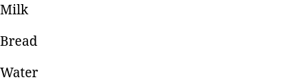
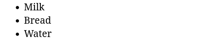
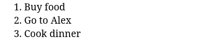

Списки — один из способов представления контента на странице. С их помощью легко группировать небольшие связанные фрагменты, например список покупок:

```text
- Milk
- Bread
- Water
```

Можно сделать такой список с помощью трёх параграфов, но тогда, с первого взгляда, будет казаться, что это три разные фразы не объединённые общим смыслом.



Чтобы правильно связать эту информацию используются списки. Для их создания в HTML используется несколько тегов, вложенных друг в друга:

* `<ul>` или `<ol>` для определения типа списка
* `<li>` для создания пункта списка

Общая схема разметки выглядит следующим образом:

```text
<тип_списка>
  <пункт_списка>Текст</пункт_списка>
</тип_списка>
```

## Маркированный список

Для создания маркированного списка используется тег `<ul>`.

Маркированные списки используются, когда информация не требует определённой последовательности. Например, список продуктов из примера выше. Не так важно, что будет куплено первым: молоко или хлеб, важно — купить все продукты.

```html
<ul>
  <li>Milk</li>
  <li>Bread</li>
  <li>Water</li>
</ul>
```



## Нумерованный список

Для группировки последовательной информации используются **нумерованные** списки, важной особенностью которых является наличие порядкового номера элемента.

Такие списки удобны, если обозначается последовательность действий, которые нужно совершить. Нумерованный список создаётся с помощью тега `<ol>`, внутри которого также лежат элементы в тегах `<li>`.

Список дел на день



в разметке HTML выглядит следующим образом:

```html
<ol>
  <li>Buy food</li>
  <li>Go to Alex</li>
  <li>Cook dinner</li>
</ol>
```
