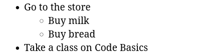

When making a to-do list, it may be necessary to break items down into several additional sub-items. For example, in the to-do list, the item "Go to the store" may contain a shopping list.

_Nested lists_ are used to create this structure. This allows you to insert a new list as a list item, rather than just text, creating a complex structure:



In HTML it looks like this:

```html
<ul>
  <li>Go to the store
    <ul>
      <li>Buy milk</li>
      <li>Buy bread</li>
    </ul>
  </li>
  <li>Take a class on Code Basics </li>
</ul>
```

It is important to note that the nested list is part of the list item and is inside the `<li>` tag:

```html
<li>Go to the store
  <ul>
    <li>Buy milk</li>
    <li>Buy bread</li>
  </ul>
</li>
```

This nesting allows you to preserve semantics and indicate that the nested list refers specifically to "Go to the store" and not to any other item.

You can nest different kinds of lists into each other: bulleted into numbered and vice versa. The main thing is to monitor the opening and closing of tags. In the case of an error, the browser will try to correct the error itself, but it may not be correct.
