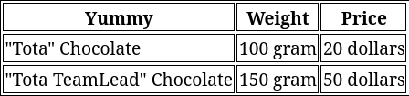
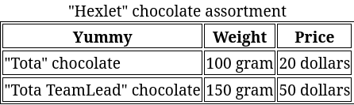

Una de las formas más comunes de presentar información es mediante tablas. Las encontramos en todas partes: información sobre productos, tablas de multiplicar, documentos. Esta presentación permite comparar fácilmente las características de diferentes productos. Al diseñar páginas, las tablas se utilizan con frecuencia, aunque su estructura puede ser un poco compleja.

Una tabla es un elemento compuesto que se crea a partir de varios tags anidados entre sí. Es similar a cómo se construyen las listas, con un contenedor y tags especiales para los elementos.

La estructura de una tabla consta de varios elementos principales:

* `<table>` — área de la tabla
  * `<tr>` — fila
  * `<thead>` — encabezado de la tabla
    * `<th>` — celda de encabezado
  * `<tbody>` — cuerpo de la tabla
    * `<td>` — celda

Cualquier tabla comienza con la etiqueta de apertura `<table>`

```html
<table>
  <!-- Aquí estarán los datos de la tabla -->
</table>
```

Es dentro de esta etiqueta que se crean las filas y las columnas de la tabla. Ahora puedes crear filas y columnas. Para hacerlo, utiliza las etiquetas `<tr>` y `<td>`. Creemos dos filas con tres celdas en cada una:

```html
<table>
  <tr> <!-- Line -->
    <td>"Tota" Chocolate</td> <!-- Cell -->
    <td>100 gram</td>
    <td>20 dollars</td>
  </tr>

  <tr> <!-- Line -->
    <td>"Tota TeamLead" Chocolate</td> <!-- Cell -->
    <td>100 gram</td>
    <td>50 dollars</td>
  </tr>
</table>
```


---

**Importante:** El número de celdas en cada fila debe ser el mismo.

---

Intenta copiar este código en el editor. Observa que la presentación visual será diferente a la de la teoría de esta lección. Esto se debe a que, por defecto, los navegadores no muestran bordes visibles para las celdas de la tabla. Para lograrlo, necesitas usar CSS, un lenguaje de estilos especial. Podrás encontrar este lenguaje y sus capacidades en otro curso.

Los datos ya están presentados, pero faltan encabezados para describir cada columna. Para crear encabezados en la tabla, utiliza la etiqueta `<thead>` y, como celda, la etiqueta `<th>`. Por lo demás, la estructura de marcado no cambia. Complementemos la tabla con encabezados:

```html
<table>
  <thead> <!-- Encabezado de la tabla -->
    <tr>
      <th>Delicia</th> <!-- Celda de encabezado -->
      <th>Peso</th>
      <th>Precio</th>
    </tr>
  </thead>

  <tr>
    <td>Chocolate "Totá"</td>
    <td>100 gramos</td>
    <td>2 dólares</td>
  </tr>

  <tr>
    <td>Chocolate "Totá TeamLead"</td>
    <td>150 gramos</td>
    <td>5 dólares</td>
  </tr>
</table>
```



El último paso es agregar la etiqueta `<tbody>`, que marca la parte principal de la tabla. A menudo los desarrolladores omiten esta etiqueta, ya que los navegadores envuelven automáticamente un grupo de filas que no están dentro de otras etiquetas. Ten en cuenta que la etiqueta `<tbody>` suele usarse solo una vez en una tabla. En tablas más grandes, se pueden usar múltiples `<tbody>` para separar diferentes secciones de la tabla, pero en la mayoría de los casos esto no es necesario.

```html
<table>
  <thead>
    <tr>
      <th>Delicia</th>
      <th>Peso</th>
      <th>Precio</th>
    </tr>
  </thead>

  <tbody> <!-- Cuerpo de la tabla -->
    <tr>
      <td>Chocolate "Totá"</td>
      <td>100 gramos</td>
      <td>2 dólares</td>
    </tr>

    <tr>
      <td>Chocolate "Totá TeamLead"</td>
      <td>150 gramos</td>
      <td>2 dólares</td>
    </tr>
  </tbody>
</table>
```

Además, se puede agregar un "footer" a la tabla. Aquí se puede incluir información resumida, como el costo total de los productos.

Puedes personalizar el título de la tabla. Esto es útil cuando se muestran varias tablas al mismo tiempo. Ayuda a distinguirlas entre sí y a no confundirse acerca de qué tabla está mostrando qué información. Para crear un título en la tabla, utiliza la etiqueta `<caption>`. Si hay un título, debe ubicarse _inmediatamente después_ de la etiqueta `<table>`. Agreguemos un título a la tabla:


```html
<table>
  <caption>Asortimento de Chocolate "Hexlet"</caption>
  <thead>
    <tr>
      <th>Delicia</th>
      <th>Peso</th>
      <th>Precio</th>
    </tr>
  </thead>

  <tbody>
    <tr>
      <td>Chocolate "Totá"</td>
      <td>100 gramos</td>
      <td>2 dólares</td>
    </tr>

    <tr>
      <td>Chocolate "Totá TeamLead"</td>
      <td>150 gramos</td>
      <td>2 dólares</td>
    </tr>
  </tbody>
</table>
```


