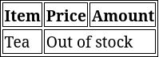

В таблицах часто нужно объединять строки или столбцы. Это помогает объединить различную информацию. Например, если в складской таблице нет товара, то нет смысла постоянно дублировать информацию — её можно объединить и написать, что товара нет на складе:



В HTML-разметке объединить ячейки в столбцах или строках можно с помощью специальных атрибутов `colspan` и `rowspan`. Их значениями является количество ячеек справа (для `colspan`) или снизу (для `rowspan`), которые нужно объединить с текущей. Отсчёт начинается с текущей ячейки, к которой применено свойство. Например, если стоит значение `colspan="2"`, то будет объединена текущая ячейка с соседней.

Разметка для примера выше без учёта объединения ячеек будет следующей:

```html
<table>
  <thead>
    <tr>
      <th>Item</th>
      <th>Price</th>
      <th>Amount</th>
    </tr>
  </thead>

  <tbody>
    <tr>
      <td>Tea</td>
      <td>Out of stock</td> <!-- the cell we want to combine -->
      <td></td>
    </tr>
  </tbody>
</table>
```

Для того чтобы объединить ячейки, нужно сделать два действия:
1. В тег ячейки, которую будем объединять, добавить атрибут `colspan` со значением, равным количеству объединяемых ячеек справа
2. Удалить лишние ячейки из строки

```html
<table>
  <thead>
    <tr>
      <th>Item</th>
      <th>Price</th>
      <th>Amount</th>
    </tr>
  </thead>

  <tbody>
    <tr>
      <td>Tea</td>
      <td colspan="2">Out of stock</td>
    </tr>
  </tbody>
</table>
```

Для объединения ячеек по вертикали используется атрибут `rowspan`. Алгоритм действий повторяет аналогичный при объединении по горизонтали. Единственное отличие — удалять ячейки нужно в соседних строках:

```html
<table>
  <thead>
    <tr>
      <th>Employee</th>
      <th>Salary</th>
      <th>Bonus</th>
      <th>Manager</th>
    </tr>
  </thead>

  <tbody>
    <tr>
      <td>Alex Primadonin</td>
      <td>750$</td>
      <td>63$</td>
      <td rowspan="2">Cody Hexly</td>
    </tr>
    <tr>
      <td>Eddie Vainy</td>
      <td>1200$</td>
      <td>0</td>
    </tr>
  </tbody>
</table>
```

В примере двое сотрудников взаимодействуют с одним менеджером. Можно указать его дважды, но нагляднее объединить ячейки по вертикали. Для этого был добавлен атрибут `rowspan="2"`, а во второй строке удалена четвёртая ячейка, так как её место займёт ячейка выше


