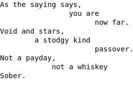

Иногда возникает потребность вставить текст, сохраняя его оригинальное форматирование. Взглянем на знаменитую «лесенку Маяковского» из стихотворения «Сергею Есенину».



Владимир Маяковский считал, что именно в таком виде лучше всего оформляется ритм стиха.

Оформить такой текст с помощью спецсимволов в HTML очень сложно. Придётся «жонглировать» пробельными спецсимволами. Из-за этого такую разметку будет очень сложно поддерживать в будущем:

```html
<p>As the saying says,</p>
<p>&nbsp;&nbsp;&nbsp;&nbsp;&nbsp;&nbsp;&nbsp;&nbsp;&nbsp;&nbsp;&nbsp;&nbsp;&nbsp;&nbsp;&nbsp;you are</p>
<p>&nbsp;&nbsp;&nbsp;&nbsp;&nbsp;&nbsp;&nbsp;&nbsp;&nbsp;&nbsp;&nbsp;&nbsp;&nbsp;&nbsp;&nbsp;&nbsp;&nbsp;&nbsp;&nbsp;&nbsp;&nbsp;&nbsp;&nbsp;&nbsp;&nbsp;&nbsp;&nbsp;&nbsp;&nbsp;&nbsp;&nbsp;&nbsp;&nbsp;&nbsp;&nbsp;now far.</p>
```

Для решения этой проблемы существует специальный тег `<pre>`, задача которого — вывести текст внутри себя с сохранением всех пробельных символов. По умолчанию тег `<pre>` выводит текст моноширинным шрифтом, в котором все символы имеют одинаковую ширину, в отличие от обычных шрифтов.

```html
<pre>
As the saying says,
              you are
                    now far.
Void and stars,
        a stodgy kind
                    passover.
Not a payday,
            not a whiskey bar.
Sober.
</pre>
```

Внутри тега `pre` можно использовать теги для оформления текста: `<i>`, `<em>`, `<b>`, `<strong>`.
