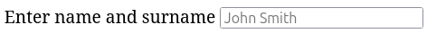
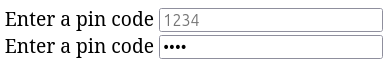

El elemento principal de los formularios en HTML es el campo de texto. Se implementa utilizando la etiqueta `<input>` y permite definir diferentes tipos de campos de entrada de datos: texto, contraseñas, casillas de verificación, botones de radio, botones de envío, carga de archivos, entrada de fechas, entre otros.

A partir de HTML5, la lista de campos se ha ampliado con muchas opciones nuevas. Los tipos básicos de campos de entrada son:

* Texto
* Contraseñas
* Casillas de verificación
* Botones de radio

La forma más sencilla de utilizar `<input>` es crear un campo de texto para la entrada. Es precisamente `<input>` el que se encuentra en todos los campos de búsqueda. Para crear un campo de texto simple, simplemente agrega la etiqueta `<input>` sin pareja dentro del formulario y especifica el atributo `type` con el valor `text`:

```html
<form>
  <input type="text">
</form>
```


## Etiqueta label

El campo está creado, pero no está claro qué se debe ingresar allí: ¿nombre, apellido, código de la caja fuerte? Para indicar el propósito del campo, se utiliza la etiqueta `<label>`. Esta es una etiqueta de pareja que se asemeja a un párrafo, pero se refiere específicamente a la descripción del campo del formulario.

```html
<form>
  <label>Enter a name</label>
  <input type="text">
</form>
```

En realidad, no es suficiente simplemente especificar `label`, es necesario vincularlo al campo del formulario. Esto es necesario para una asociación unívoca, ya que puede haber muchos campos.

Para vincular `label`, se utiliza una de las dos opciones:

* Vinculación mediante el atributo `id`. Para ello, la etiqueta `<input>` debe tener el atributo `id` con un nombre arbitrario, y la etiqueta `<label>` debe tener el atributo `for` con el mismo nombre que el valor `id` del elemento `input`.

```html
<form>
  <label for="name">Enter a name</label>
  <input type="text" id="name">
</form>
```

* Vinculación mediante anidamiento. ¿Has notado que `<label>` es una etiqueta de pareja? Para vincularlos, puedes anidar `input` dentro de `label`, de esta manera se vincularán automáticamente.

```html
<form>
  <label>Enter a name
    <input type="text">
  </label>
</form>
```

## Atributo placeholder

A veces hay situaciones en las que hay una descripción para el campo, pero no está claro en qué formato se deben completar los datos. Por ejemplo, ¿primero se debe ingresar el nombre y luego el apellido, o viceversa? Para ayudar al usuario a orientarse, se utiliza el atributo `placeholder` en la etiqueta `<input>`. El valor de este atributo se mostrará dentro del campo de texto.

```html
<form>
  <label for="name">Enter name and surname</label>
  <input type="text" id="name" placeholder="John Smith">
</form>
```



## Otros campos de texto

¿Has notado que al ingresar contraseñas, el navegador automáticamente muestra asteriscos en lugar de los caracteres? Esto se puede lograr especificando el valor `password` para el atributo `type`:

```html
<form>
  <label for="pin">Enter a pin code</label>
  <input type="password" id="pin" placeholder="1234">
</form>
```



En HTML5 se han agregado varios tipos interesantes más para la etiqueta `<input>`, que implementan un campo de texto normal pero con su propia implementación. Por ejemplo:

* `email`
* `number`
* `search`
* `tel`
* `url`

Su propósito es que los valores se verifiquen automáticamente por el navegador. Por ejemplo, si se ingresa el valor `email`, el navegador esperará una plantilla correcta para una dirección de correo electrónico. De lo contrario, indicará que el valor es incorrecto al intentar enviar el formulario.

Los dispositivos móviles también tienen en cuenta estos campos. En las versiones modernas de los sistemas operativos móviles, el teclado se adapta al tipo de campo que se está completando. Si se establece el tipo `email`, se agregará automáticamente el símbolo `@` al teclado para no tener que buscarlo entre los caracteres adicionales.
