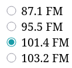

Imagina que le estás ofreciendo al usuario la opción de elegir entre entregar un producto por mensajería o por correo. En este caso, no se pueden utilizar casillas de verificación, ya que la elección es estrictamente una.

Para crear botones de opción que solo puedan procesar una de varias opciones, se utilizan los botones de radio. Reciben su nombre de las antiguas radios de los automóviles, en las que se seleccionaba una frecuencia presionando uno de los muchos botones disponibles.



Para crear un botón de radio, al igual que con una casilla de verificación, se utilizan dos etiquetas:

* `<input>` con el atributo `type="radio"`. El atributo obligatorio es `name`, cuyo valor es el nombre. Este nombre debe ser el mismo para todo el grupo de botones de radio. Sin este atributo, será posible seleccionar todos los valores a la vez, ya que el navegador no reconocerá la relación entre ellos.
* `<label>`, que contendrá el texto asociado al botón de radio que necesitamos

La asociación entre `<input>` y `<label>` se realiza de una de las dos formas que ya conocemos:

* Asociación por `id`. Para ello, debes asignar un `id` único al `<input>` y vincular el `<label>` al botón de radio mediante el atributo `for`

  ```html
  <form>
    <input id="yes" type="radio" name="question">
    <label for="yes">Sí</label>

    <input id="no" type="radio" name="question">
    <label for="no">No</label>
  </form>
  ```

* Insertar `<input>` dentro de la etiqueta `<label>`. En este caso, no es necesario especificar un `id` único

  ```html
  <form>
    <label>
      <input type="radio" name="question">
      Sí
    </label>
    <br>
    <label>
      <input type="radio" name="question">
      No
    </label>
  </form>
  ```

Para poder saber qué opción se seleccionó después de enviar el formulario al servidor, se utiliza el atributo `value`, que contiene el valor que permite identificar el botón de radio.

```html
<form>
  <label>
    <input type="radio" name="question" value="yes">
    Sí
  </label>
  <br>
  <label>
    <input type="radio" name="question" value="no">
    No
  </label>
</form>
```
