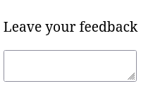
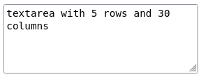

Часто мы хотим дать пользователю возможность набрать не одну строчку текста, а сразу несколько. Например, если пользователь хочет оставить отзыв. Для этого используется элемент `<textarea>`, позволяющий вводить несколько строчек текста.



```html
<form>
  <textarea></textarea>
</form>
```

Заметьте, что `<textarea>` является парным тегом. Это означает, что вы можете вложить в него текст по умолчанию, чтобы пользователь быстрее понял, что ему необходимо ввести.

По умолчанию высота и ширина `<textarea>` зависит от настроек браузера. Это значит, что в разных браузерах высота и ширина может меняться. Для того, чтобы установить одинаковое значение, используются атрибуты `rows` и `cols`, означающие количество строк и столбцов соответственно.

```html
<form>
  <textarea rows="5" cols="30">textarea with 5 rows and 30 columns</textarea>
</form>
```


