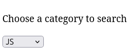
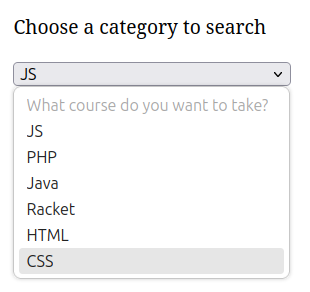
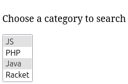

In many forms, the user often has to choose from a variety of options. This can be the categories we want to search by, or a choice of different search options. The most common solution is to use drop-down lists:

```html
<p class="lead">Choose a category to search</p>
<form>
  <select class="form-select">
    <option>JS</option>
    <option>PHP</option>
    <option>Java</option>
    <option>Racket</option>
    <option>HTML</option>
    <option>CSS</option>
  </select>
</form>
```



To create a drop-down list like this, use the tag `<select>` with `<option>` sub tags inside it. This is similar to creating normal lists, but`<select>` is used instead of `ul/ol` and `<option>` is used instead of `<li>`.

Often the first item in a list is used to head the entire drop-down list. In that case, the `disabled` attribute can be is used to block it from being selected.

```html
<form>
  <select>
    <option disabled>What course do you want to take?</option>
    <option>JS</option>
    <option>PHP</option>
    <option>Java</option>
    <option>Racket</option>
    <option>HTML</option>
    <option>CSS</option>
  </select>
</form>
```



The list inside the form can also be represented as a list, in which you can select multiple items. This is done by holding down the `Сtrl` button and clicking on the fields we want to select.



In order to create a list with multiple choices, we add the attribute `multiple` to the `<select>` tag.

```html
<form>
  <select multiple>
    <option>JS</option>
    <option>PHP</option>
    <option>Java</option>
    <option>Racket</option>
    <option>HTML</option>
    <option>CSS</option>
  </select>
</form>
```
