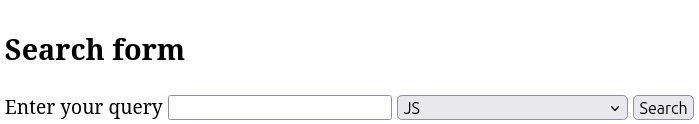

The last step in creating the form is to add a button to send the result to the server. To do this, use the paired `<button>` tag to create a submit button:

```html
<form>
  <button>Submit</button>
</form>
```

After clicking on the "Submit" button, the data will be sent to the handler that is specified in the `action` attribute (if not specified, the data will be sent to the same page). **The page will reload after you submit the data**.

Now, using the form elements from the previous lessons, create a form with different fields.

```html
<h2>Search form</h2>
<form>
  <label>
    Enter your query
    <input type="search">
  </label>
  <select>
    <option disabled>Choose section to search in</option>
    <option>JS</option>
    <option>HTML</option>
    <option>CSS</option>
  </select>
  <button>Search</button>
</form>
```




If you click the "Search" button, the page will reload, and the data should go to the handler on the same page. Since there is no handler, there will be no visible results other than a page reload.
