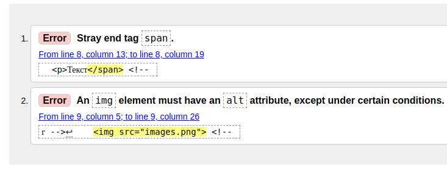

При разметке контента на странице часто возникают проблемы: забыли закрыть тег, вложили элементы, которые вкладывать нельзя, забыли указать обязательные теги.

```html
<!DOCTYPE html>
<html lang="ru">
<head>
  <meta charset="UTF-8">
  <title>Примеры ошибок</title>
</head>
<body>
  <p>Текст</span> <!-- Закрыли не тот тег -->
   <!-- Не указали обязательный атрибут alt -->
</body>
</html>
```

В большинстве случаев такие ситуации не страшны. Разработчики браузеров внедряют автоматические проверки кода на ошибки, которые могут привести к нарушению отображения разметки, и при их наличии пытаются автоматически исправить проблему. При простых ошибках такой подход оправдан и позволяет разработчикам не беспокоиться о забытом теге `<html>` или `<body>`. В сложных же ситуациях такие ошибки могут быть трудно уловимы, и зачастую разработчики долго сидят над кодом и ищут их.

Для решения таких проблем созданы специальные валидаторы HTML-разметки, которые автоматически проверяют код на ошибки. Можно указать ему ссылку на страницу или готовый фрагмент HTML-разметки, после чего валидатор выдаст список предупреждений и ошибок. На примере выше валидатор покажет следующие ошибки:



1. Отсутствие открывающего тега `<span>`, который сейчас оказался закрыт. Обычно это означает, что мы или случайно закрыли не тот тег, как в данном случае, или открыли не тот. Современные редакторы кода помогают избежать этой ошибки, так как они автоматически закрывают теги при их создании.
2. Отсутствие обязательного атрибута `alt` у тега ``.

Распространённым валидатором является онлайн сервис от W3C, его можно найти по ссылке [https://validator.w3.org/](https://validator.w3.org/). Он поддерживает все стандарты HTML, поэтому важно не забывать проверять разметку с его помощью.
